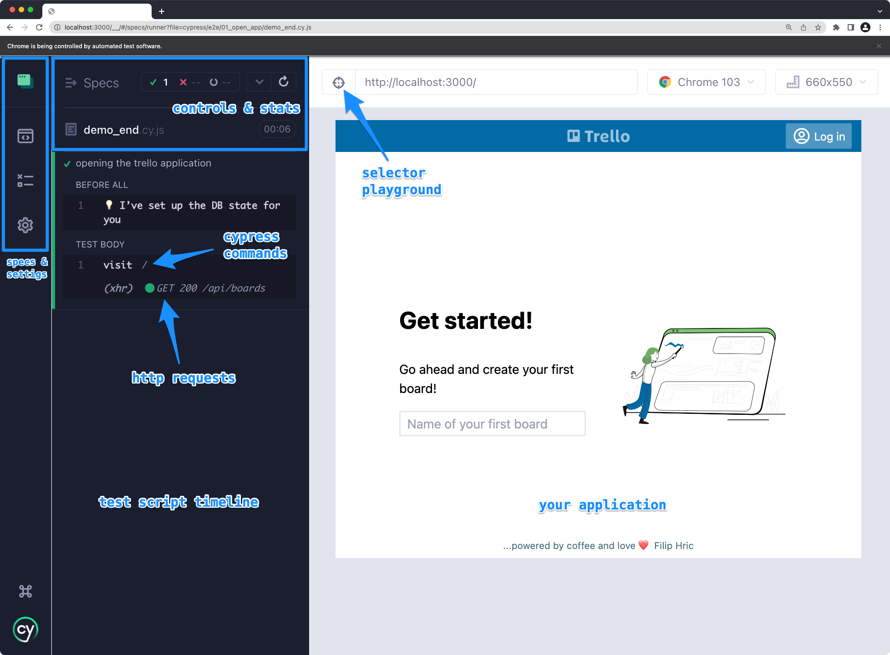

# Opening the application

## Cypress command

This is how a test looks like:
```js
it('name of the test', () => {
  // your commands will be here
})
```

A basic structure of a command is this:
```js
cy.visit('http://localhost:3000')
```
`cy` - is a global Cypress object, contains all commands

`.visit()` - is a command (or a JS function) for opening a page in Cypress

`'http://localhost:3000'` - is a parameter of our `.visit()` function. tells the function which location we want to visit

## Cypress configuration
Instead of writing a full URL, we can define a `baseUrl` in `cypress.config.js` file:
```js
{
  e2e: {
    baseUrl: "http://localhost:3000"
  }
}
```
This means we can open our home page like this:
```js
cy.visit('/')
```
or visit a board like this:
```js
cy.visit('/board/1')
```

### Cypress runner


## Useful reading
* [documentation for .visit() command](https://docs.cypress.io/api/commands/visit.html#Syntax)
* [Best practices for using baseUrl](https://docs.cypress.io/guides/references/best-practices.html#Setting-a-global-baseUrl)
* [Nice video about the reason why Cypress runner reloads](https://www.youtube.com/watch?v=f5UaXuAc52c)