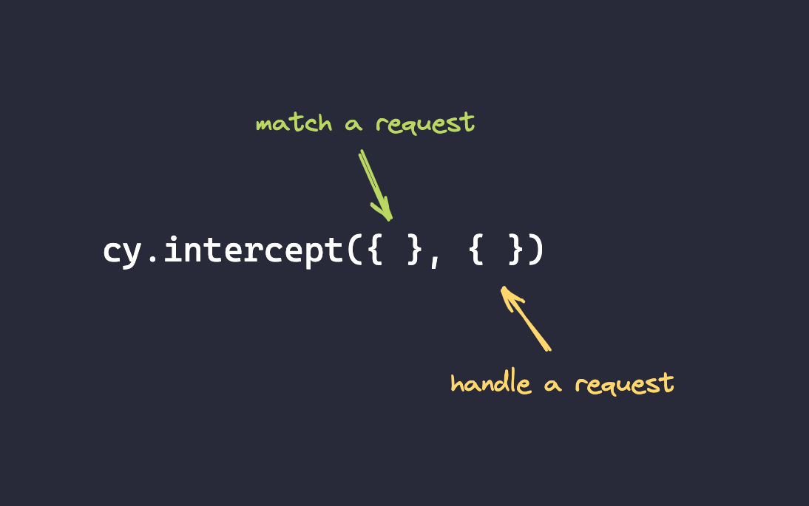

# Stubbing network requests

- intercept allows us to change the response or any other attributes of a request
- we can mock our server, or change request attributes to test different edge cases of our app

## `.intercept()` command takes two objects

- we can define `body` and provide a response to our test
- we can provide a static fixture from a file using `fixture` attribute:
```js
cy.intercept({
    method: 'GET', 
    url: '/api/boards'
  }, {
    fixture: 'twoBoards'
  })
```

## testing error messages
- defining `status` or `forceNetworkError` attributes to the handler object:
```js
cy.intercept('POST', '/api/boards', {
    forceNetworkError: true
  })
```
or change status code:
```js
cy.intercept('GET', '/api/boards', {
    statusCode: 403
  })
```

## dynamic changes
- instead of handler object, we can pass a handler function and change parameters dynamically

```js
cy.intercept({
  method: 'GET',
  url: '/api/boards'
}, (req) => {
  req.reply(res => {

    res.delay = 8000

  })
})
```

## matching only selected amount of requests
- we can define how many times we want to catch a certain request, so that the matching and handling is done effectively
```js
cy.intercept({
  method: 'GET',
  url: '/api/boards',
  times: 1
}
```

## Useful reading
- [my course on testing edge cases using .intercept() command](https://egghead.io/courses/test-network-edge-cases-with-cy-intercept-command-in-cypress-0fd94c68?af=1mdhb0)
- [docs about stubbing responses](https://docs.cypress.io/api/commands/intercept.html#Stubbing-a-response)
- [using fixtures with stubbed responses](https://docs.cypress.io/guides/guides/network-requests.html#Fixtures)
- [my article on the topic of intercpet](https://egghead.io/blog/intercepting-network-requests-in-cypress)