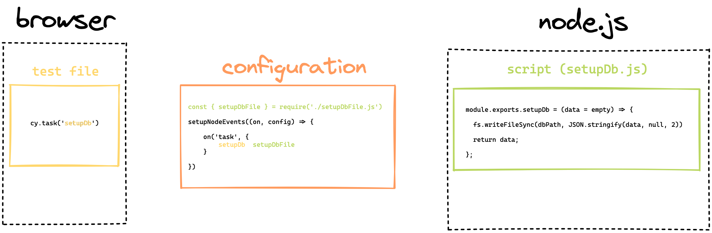

# Running Node.js scripts in test
Cypress tests run in browser. But setting up `setupNodeEvents()` function can give you access to the node.js environment as well. And you can do that while you are running your tests in the browser. This can be super useful for stuff like seeding your database, checking downloaded files and much more. 

Mentioned cases can be handled by two parameters of the `setupNodeEvents()` function. This function looks something like this in our `cypress.config.js` file:

```js
setupNodeEvents(on, config) {

}
```

## on()
This is a function that let’s us tap in to many of the runtime events. The most frequently used is `task` which happens whenever we call `cy.task()` in our test. Cool thing is that we get to define our own tasks and let Cypress knwo what it should do when e.g. a task with a name `seedDatabase` will run. This definitions are inside our `cypress.config.js` file. The whole structure of the browser -> node communication can be explained by a diagram:



This script can be anything you can run in node! Imagine that this will do a select query in your database or find a file in your filesystem. Options are endless!

## Useful reading
* [.task() command documentation](https://docs.cypress.io/api/commands/task)
* [writing a configuration plugin](https://docs.cypress.io/api/plugins/writing-a-plugin)
* [my blog on writing configuration plugin (v9)](https://filiphric.com/create-a-configuration-plugin-in-cypress)
* [Documentation on configuration](https://docs.cypress.io/guides/references/configuration)
* [Cypress.config() object](https://docs.cypress.io/api/cypress-api/config#Syntax)
* [Cypress.env() object](https://docs.cypress.io/api/cypress-api/env)
* [Setting up env variables](https://docs.cypress.io/guides/guides/environment-variables)